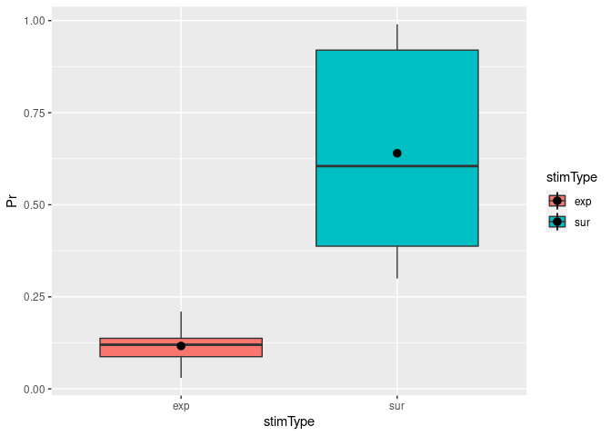

-   [Introduction](#introduction)
-   [How do I get started?](#how-do-i-get-started)
-   [Where can I get help?](#where-can-i-get-help)
-   [Common analysis steps](#common-analysis-steps)
    -   [I. Read raw data](#i.-read-raw-data)
        -   [(An aside about file paths)](#an-aside-about-file-paths)
        -   [Let’s have a look at a few cases that you may run
            into:](#lets-have-a-look-at-a-few-cases-that-you-may-run-into)
    -   [II. Clean up and preprocess raw
        data](#ii.-clean-up-and-preprocess-raw-data)
    -   [III. Aggregate raw data](#iii.-aggregate-raw-data)
    -   [IV. Descriptive analysis and
        plots](#iv.-descriptive-analysis-and-plots)
        -   [Descriptive stastics: Getting a sense of your
            data](#descriptive-stastics-getting-a-sense-of-your-data)
        -   [Confidence intervals](#confidence-intervals)
        -   [Data visualisation magic](#data-visualisation-magic)
            -   [Boxplots](#boxplots)
            -   [Adding titles and labels](#adding-titles-and-labels)
            -   [Spaghetti plots](#spaghetti-plots)
            -   [Fancy Barplots](#fancy-barplots)
            -   [Visualising correlations with scatter
                plots](#visualising-correlations-with-scatter-plots)

## Introduction

Dear students, In this document, I will provide some tips that are meant
to help you to use R independently. Most of you have already worked with
R in the ExPra or other courses, and things may have seemed very clear
to you back then. However, when you have to create your own analysis
script from scratch, you may sometimes be a little lost. I thus
summarized a few key points that can help you to find your way in the
jungle!

Please make sure that you always try to figure out the solution yourself
first. If you are stuck, ask your peers (or your supervisor if your
peers cannot help you), and make sure that you provide all the
information needed to understand both your question and your first
approach to solve the problem.

Enjoy reading!

You should be familiar with some basics in R before you continue. Check
out [my introductory file](to%20be%20provided).

If you need more input, I suggest to work with an online tutorial of
your choice. For example, check out these three
([1](https://djnavarro.github.io/chdss2018/day0/introtoR1-handout.pdf),
[2](https://djnavarro.github.io/chdss2018/day0/introtoR2-handout.pdf),
[3](https://djnavarro.github.io/chdss2018/day0/introtoR3-handout.pdf))
suggestions on first steps in R. And, last but not least, check out the
suggestions on our [lab
manual](https://gitlab.com/Soph87/LISCOlab/-/wikis/LISCOLabManual#behavioral-analyses)!

You may also want to checkout the documentation on [R
Markdown](https://rmarkdown.rstudio.com/index.html).

You should know the following concepts:

-   What is a data frame? How is it different from a matrix?  
-   How can I access certain data points in a data frame? How can I
    select certain rows or columns?  
-   Which classes of data are there?
-   What is a function and how is a function different from a script?
-   What is a boolean expression?  
-   Why are there different packages? How can I install packages?

## How do I get started?

Before you write your first line of R code, make sure that you know
exactly what you would like to do and how. Here are some examples for
very general questions: Do you want to calculate an average? Do you want
to make a t-test or rather a calculate a correlation? What are your
independent and dependent variables?

Once your general approach is clear, ask yourself more specific
questions such as: In which columns of my data frame do I find my
independent variables? Do I want to correct for outliers? Which lines
should be deleted if I want to exclude practice blocks?  
Just imagine your data frame was a table on a physical sheet of paper
and your only tool was a simple calculator. What would be your analysis
steps?

Very often, students tell me that they do not know how to handle R, but
very soon, I realize that they actually do not know what they want to
do! So make sure that every single step of your analysis is clear to
you. I suggest to write down your analysis steps into your script (as
comments). Once you are done and your concept makes sense to you, you
can fill up with actual code. This way, you have already made sure that
your documentation is done well, since there should be a balance of
50:50 between comments and code.

Generally speaking, your script should be structured like this:

1.  Start your script with a title, your name, and the current date. If
    your script is based on an older script, provide this information as
    well.  
2.  Clean up your global environment.

``` r
rm(list = ls())
```

1.  Continue with your parameters. These are values that you may
    eventually want to change and that you do not want to search for in
    every single line of your script. For example, you write your data
    path here, or you define the different age groups that you have
    tested. Just make sure you write your script in such a way that you
    can use it at multiple occasions (which may become relevant for your
    master’s thesis).  
2.  Continue with your actual analysis. Provide some structure and
    comment everything you do. Documentation is important so that the
    script is understandable for others, both your collaborators and
    your future self.

## Where can I get help?

After you gained some basic knowledge in R, you should definitely not
expect to sit down in front of your computer and then, magically, your
fingers just type down all code. It is a matter of constant improvement,
and you will have to learn how to use new functions all the time!  
**It is normal to look up how to do certain things, even if you have
dealt with a similar problem before.**  
Here are three main sources of help for your script:

1.  Recycle elements from previous scripts. This is actually quite
    useful because you have already figured it out once before.
    **Remember to always provide comments on what you are doing in the
    script, in order to be able to recycle stuff in the future.**
2.  Use a search engine of your choice and look up your question in the
    internet. The community is huge and usually very friendly, and
    chances are quite high that somebody else has encountered your
    problem before. (You can also post questions yourself if nobody has
    asked your questions before, but this will most likely not be the
    case.) Search in English. I like pages such as stackoverflow and
    github for helpful discussions.  
    It will take some time until you know how to ask your questions
    properly. Your first search term should of course be “R”. Use key
    words from R and psychology, such as “data frame”, “columns”,
    “outlier”… If you put too many terms into the search window, you
    will probably get a lot of results that are not related to your
    question, so try to be precise. When you realize that the answers
    you get are rather remote from what you actually want, change your
    search terms.
3.  Use the help function in R. This requires some practice and may not
    always help you when you are new to it. I find it useful for the
    list of input arguments and the examples provided in the end.

## Common analysis steps

All analyses are of course different, but there are some common analysis
steps that we encounter most of the time:

1.  Read raw data  
2.  Clean up and preprocess raw data  
3.  Aggregate raw data  
4.  Descriptive analysis and plots

We will go through them step by step.

### I. Read raw data

Getting error messages in R can be frustrating at the beginning.
However, it is quite normal, and you will learn to read the error
messages such that they can guide you to the solution. Not handling your
raw data properly, on the other hand, can lead to REAL PROBLEMS!!!

You have to be super careful with your raw data. Store it at multiple
sites on different drives. And NEVER, really **NEVER EVER, write into
your raw data directory.** This is why we call our raw data directory
sometimes “Holy Folder”, and it must NEVER be touched other than for
reading the data so that you can never accidentally overwrite it.

That is why we need an “inPath” and an “outPath”, one directory to read
from, one to write into. Create a directory with all participants’ raw
data. If you already know that you want to exclude a participant for
whatever reason, you can already omit the respective file at this stage.
Create a directory called “Analyses” or something similar. Always choose
meaningful names and avoid spaces or special characters.

It is very common that there are errors in your paths. In order to avoid
typos, I suggest that you browse to your directory and then copy the
path from there (e.g., from your browser header, or by selecting the
properties of a file in that directory). This can be especially helpful
for long and complicated paths. If you use Windows, you may need to
change the slashes.  
Make sure that you do not forget the ” “.  
And, last but not least, and that is very often overlooked by beginners:
**Do not forget the last slash in the end! ;-)**

You can also set your working directory in R under “Session” -\> “Set
Working Directory” (to your outPath).

I recommend to never use spaces or special characters in your path. It
may be worthwhile renaming your directories. The same is true for all
objects/column names/characters you create in R. It is not impossible to
handle spaces in R, but it is definitely more troublesome.

Remember that your paths should be defined at the beginning of your
file.

##### (An aside about file paths)

As you begin using R in more of your projects, some of which may involve
collaboration, you may begin to notice that dealing with paths and
working directories can get, well, pesky. An example: your colleague
Bailey sends you a folder with their data and analysis scripts. In the
script, they begin with setting the working directory using:

Or at various points in the file, they load data using:

It’s easy to see how the specificity of file paths can quickly get
annoying and make the script fragile. You are not Bailey, so you will
have to change all of the paths in the files for the script to work
again. And what if you were working on a script but then you get a new
computer? What if you forgot one tiny “/” and now you want to set your
computer on fire? And so on and so on.

A package that offers answers to these issues is the here() package.
Combined with a logical folder structure, here() can improve the
flexibility of your scripts so that neither you nor your collaborators
will have to rename another file path again. Anywhere you would use
“C:/filepath/blahblah”, you can replace with here(). You can check out a
straightforward guide to using it \[here\]
(<http://jenrichmond.rbind.io/post/how-to-use-the-here-package/>) (no
pun intended).

#### Let’s have a look at a few cases that you may run into:

-   We very often read data from csv files. There are specific functions
    for reading csv files that you can use. I personally prefer the
    function “fread” because it can handle various data types quite
    easily.  
    This is how you can read all your participants’ data files into one
    data frame at once:

    library(data.table) \# fread is part of the library
    “data.table”``filenames \<- list.files(inPath, pattern=“\*.csv”,
    full.names=TRUE) \# Create a list of your data files``myData \<-
    rbindlist(lapply(filenames,fread),fill=TRUE) \# Read in your data
    files and concatenate them to one big data frame.

-   Sometimes, you may need to open data files saved with SPSS. SPSS is
    a commercial software and not everybody may have the license
    installed, so it can be quite tricky to open these kinds of files. I
    suggest to use the package “haven” for this matter.

    `library(haven) # This library is useful to deal with SPSS files.'`
    `SPSSfile <- "myOtherData.sav" # Define the name of your SPSS file.`
    `myOtherData <- read_sav(paste(inPath, SPSSfile, sep = "")) # Read in SPSS data. Note how I used "paste" to concatenate two character values (your path name and your file name).`

-   If you tested mutliple groups (e.g., children, young adults, and
    older adults), you may want to organize their data in different
    folders. In this case, I recommend to loop through these folders and
    add up all files into one single data frame. Just provide a vector
    of character values as “inPath”, with each character vector
    representing one path.

    ``` r
    # Define inPath
    inPath <- c("/home/soph/Documents/thesis/HolyFolder/Child/"
                , "/home/soph/Documents/thesis/HolyFolder/YA/"
                , "/home/soph/Documents/thesis/HolyFolder/Child/OA/")
    ```

    Next, create an empty data frame with the same amount of columns and
    the same column name as in your actual raw data.

    `allGroups <- setNames(data.frame(matrix(ncol = 9, nrow = 0))`
    `, c("participant", "group", "age", "sex", "handedness"`
    `, "IV1", "IV2", "DV1", "DV2"))`

    Loop through the different directories and read the data from each
    directory one after another (e.g., into a data frame called
    “myData”). Add it all to your empty data frame at the end of each
    iteration.

    `allGroups <- rbind(allGroups, myData)`

    Tip 1 for using loops: Restrict the use of loops to a minimum, since
    R is not really fast dealing with loops (but it will do it
    eventually).

    Tip 2 for using loops: Use a meaningful term for the value that
    changes at each iteration. “val” or “i” are not meaningful, but
    “iGroup” or “iParticipant” are. This will help you to keep track of
    what you are actually doing, especially in nested loops.

-   In some cases, multiple files per participant are generated and you
    may want merge the different files. For example, you have one file
    for a memory encoding session and one file for a memory retrieval
    session. It can be useful to have the two sessions organized as
    different columns and each line referring to a specific stimulus. In
    this case, check out a “merge” function (I like the one from the
    package “data.table”) in these cases.

Once your data are all in, you should take some time to check if all
data looks as it is supposed to be. Are all subjects there? Is the
number of lines as expected (this is very often the number of trials by
the number of participants). Are all conditions there? Is the number of
trials for each condition correct? For this purpose, use the “table”
function. Have a look at your “global environment” as well were you can
see the dimensions of your data frame.

### II. Clean up and preprocess raw data

Our raw data files are usually organized such that one line contains all
information from one trial. However, there may be trials that we do not
need such as practice trials. Or there may be empty lines between blocks
that we also do not need.

Let’s have a look at the following example:

``` r
# Let's create a little example data frame.
example1 <- setNames(data.frame(matrix(ncol = 5, nrow = 10))
                    , c("participant", "OS", "blockNumber", "DV", "IV"))
# Values in columns
example1[1:5,1] <- 5
example1[6:10,1] <- 6
example1[,2] <- as.character("Windows")
example1[,3] <-c(NA,1,1,2,2,NA,1,1,2,2)
example1[,4] <- c(.5,.6,.7,.7,.8,.9,.9,.8,.5,.7)
example1[,5] <- c("B","A","B","B","A","B","B","A","B","A")
example1
```

    ##    participant      OS blockNumber  DV IV
    ## 1            5 Windows          NA 0.5  B
    ## 2            5 Windows           1 0.6  A
    ## 3            5 Windows           1 0.7  B
    ## 4            5 Windows           2 0.7  B
    ## 5            5 Windows           2 0.8  A
    ## 6            6 Windows          NA 0.9  B
    ## 7            6 Windows           1 0.9  B
    ## 8            6 Windows           1 0.8  A
    ## 9            6 Windows           2 0.5  B
    ## 10           6 Windows           2 0.7  A

The column “blockNumber” contains, well, the block number. Lines with NA
are practice trials. We can remove them like this:

``` r
example1 <- example1[!is.na(example1$blockNumber),] # Check the different parts of this line. What do the "!" and "is.na" do? Also check out the position of the comma in the square brackets. Remember: Zeilen zuerst, Spalten später!
example1
```

    ##    participant      OS blockNumber  DV IV
    ## 2            5 Windows           1 0.6  A
    ## 3            5 Windows           1 0.7  B
    ## 4            5 Windows           2 0.7  B
    ## 5            5 Windows           2 0.8  A
    ## 7            6 Windows           1 0.9  B
    ## 8            6 Windows           1 0.8  A
    ## 9            6 Windows           2 0.5  B
    ## 10           6 Windows           2 0.7  A

We probably also want to remove the column “OS” because it is not very
helpful here. You can select specific columns by index or name, and you
can also delete specific columns.

The following three code chunks do the same thing:

``` r
example1_copy <- example1 # Let's create a copy of example1 so we can do the same stuff over and over again.
example1 <- example1[,c(1,3,4,5)] # Select certain columns by index. Check out the position of the comma.
example1
```

    ##    participant blockNumber  DV IV
    ## 2            5           1 0.6  A
    ## 3            5           1 0.7  B
    ## 4            5           2 0.7  B
    ## 5            5           2 0.8  A
    ## 7            6           1 0.9  B
    ## 8            6           1 0.8  A
    ## 9            6           2 0.5  B
    ## 10           6           2 0.7  A

``` r
example1 <- example1_copy # Back to our previous data frame.
example1 <- example1[,c("participant", "blockNumber", "IV", "DV")] # Select certain columns by name.
example1
```

    ##    participant blockNumber IV  DV
    ## 2            5           1  A 0.6
    ## 3            5           1  B 0.7
    ## 4            5           2  B 0.7
    ## 5            5           2  A 0.8
    ## 7            6           1  B 0.9
    ## 8            6           1  A 0.8
    ## 9            6           2  B 0.5
    ## 10           6           2  A 0.7

``` r
example1 <- example1_copy # Back to our previous data frame.
example1$OS <- NULL # Delete a single columns by its name.
example1
```

    ##    participant blockNumber  DV IV
    ## 2            5           1 0.6  A
    ## 3            5           1 0.7  B
    ## 4            5           2 0.7  B
    ## 5            5           2 0.8  A
    ## 7            6           1 0.9  B
    ## 8            6           1 0.8  A
    ## 9            6           2 0.5  B
    ## 10           6           2 0.7  A

Actually, this would also be a good moment to organize the order of your
columns in a more useful way. I prefer to start with the participant
number, the group, time of testing, personal information like age and
gender, information on stimuli, independent variables, and dependent
variables in the end.  
In the example above, it could be nice to switch the position of the
independent and dependent variable.

The following two code chunks do the same thing:

``` r
example1 <- example1_copy # Back to our previous data frame.
example1 <- example1[,c(1,3,5,4)] # Omit the second block and switch the two last blocks.
example1
```

    ##    participant blockNumber IV  DV
    ## 2            5           1  A 0.6
    ## 3            5           1  B 0.7
    ## 4            5           2  B 0.7
    ## 5            5           2  A 0.8
    ## 7            6           1  B 0.9
    ## 8            6           1  A 0.8
    ## 9            6           2  B 0.5
    ## 10           6           2  A 0.7

``` r
example1 <- example1_copy # Back to our previous data frame.
example1 <- example1[,c("participant", "blockNumber", "IV", "DV")] # Or use the variable names.
example1
```

    ##    participant blockNumber IV  DV
    ## 2            5           1  A 0.6
    ## 3            5           1  B 0.7
    ## 4            5           2  B 0.7
    ## 5            5           2  A 0.8
    ## 7            6           1  B 0.9
    ## 8            6           1  A 0.8
    ## 9            6           2  B 0.5
    ## 10           6           2  A 0.7

Sometimes, you need to calculate new variables. Imagine the
participants’ task was to indicate if a letter was a vowel or a
consonant with a left or a right key press. Imagine also that the
response mapping was counterbalanced, hence, half of the participants
were supposed to respond to a vowel with a left key press and to a
consonant with a right key press whereas the other half of the
participants had the reversed mapping. Your software may have recorded
whether the participants responded with a left or a right key press at a
given trial, but not necessarily if participants wanted to indicate that
they saw a vowel or a consonant, and if their response was correct.
Let’s check out how we could create new variables in this case.

Let’s create another little example data frame.

``` r
# Let's create a little example data frame.
example2 <- setNames(data.frame(matrix(ncol = 4, nrow = 8))
                    , c("participant", "stimulus", "counterbalancing", "response"))
# Values in columns
example2[1:4,1] <- 1
example2[5:8,1] <- 2
example2[,2] <- c("V","C","C","V","C","V","C","V")
example2[,3] <-c("vowel_left", "vowel_left", "vowel_left", "vowel_left", "cons_left", "cons_left", "cons_left","cons_left")
example2[,4] <- c("l", "r", "l", "l", "l", "l", "r", "r")
example2
```

    ##   participant stimulus counterbalancing response
    ## 1           1        V       vowel_left        l
    ## 2           1        C       vowel_left        r
    ## 3           1        C       vowel_left        l
    ## 4           1        V       vowel_left        l
    ## 5           2        C        cons_left        l
    ## 6           2        V        cons_left        l
    ## 7           2        C        cons_left        r
    ## 8           2        V        cons_left        r

Let’s first calculate a new variable that contains the meaning of the
response.

``` r
example2$responseType <- "V" # As a default we put vowel.
example2$responseType[example2$counterbalancing == "vowel_left" & example2$response == "r"] <- "C" # If the participant is supposed to indicate consonants with the right response (belongs to the first counterbalancing group) and responded with the right key.
example2$responseType[example2$counterbalancing == "cons_left" & example2$response == "l"] <- "C" # If the participant is supposed to indicate consonants with the left response (belongs to the second counterbalancing group) and responded with the left key.
example2
```

    ##   participant stimulus counterbalancing response responseType
    ## 1           1        V       vowel_left        l            V
    ## 2           1        C       vowel_left        r            C
    ## 3           1        C       vowel_left        l            V
    ## 4           1        V       vowel_left        l            V
    ## 5           2        C        cons_left        l            C
    ## 6           2        V        cons_left        l            C
    ## 7           2        C        cons_left        r            V
    ## 8           2        V        cons_left        r            V

Let’s calculate accuracy as well. 0 = incorrect response, 1 = correct
response.

``` r
example2$accuracy[(example2$stimulus == "V" & example2$responseType == "V") | (example2$stimulus == "C" & example2$responseType == "C")] <- 1 # Let's find the cases where stimulus and responseType match. Have alook at how I combined logical "and" and "or" and how I used brackets here.
example2$accuracy[is.na(example2$accuracy)] <- 0 # Now let us fill up with zeros for the incorrect responses.
example2
```

    ##   participant stimulus counterbalancing response responseType accuracy
    ## 1           1        V       vowel_left        l            V        1
    ## 2           1        C       vowel_left        r            C        1
    ## 3           1        C       vowel_left        l            V        0
    ## 4           1        V       vowel_left        l            V        1
    ## 5           2        C        cons_left        l            C        1
    ## 6           2        V        cons_left        l            C        0
    ## 7           2        C        cons_left        r            V        0
    ## 8           2        V        cons_left        r            V        1

Once again, check if all data are as they are supposed to be! The
“table” function helps you here.  
If everything looks good, this would be a good moment to save your data
frame to disk, e.g., in a csv file.

### III. Aggregate raw data

Aggregating means summarizing your data. For example, you may be
interested in averaging all trials of each condition and each
participant. For example, if you have two conditions, you may want to
average all trials such that there are two averages per participant in
the end, one for each condition.

Sometimes, we need to exclude outliers before we average raw data. For
example, when you average response times, very slow responses may bias
your averages strongly. You do not want to include these response times
in your analysis. This is how you can proceed:

-   Use the function “group_by” of “dplyr” to group your data frame by
    participant. This could look like this:  
    `myData <- group_by(myData, participant)`  
    You may be disappointed: Your data frame looks as it has looked
    before. However, all consecutive commands will be executed within
    the trials belonging to the same participant. Later, use `ungroup`
    if you do not want grouping anymore.  
-   Create a new column that contains your z-transformed response times.
    There are plenty of ways to do the z-transform. I like the function
    “scale”.  
-   Delete all rows that contain a z-value that exceeds your criterion
    (e.g., 3). You already know how to do this! Check out the “clean up
    raw data” section for inspiration!

In a similar way, you can also remove very fast responses, e.g. \< 50
ms. In this case, you can work directly with the raw response times, no
need for transforms!

Let us continue. I will provide an example data frame for you with one
between IV, one within IV, and accuracy as DV:

``` r
example3 <- setNames(data.frame(matrix(ncol = 4, nrow = 12))
                    , c("participant", "IV1", "IV2", "accuracy"))
# Values in columns
example3[1:6,1] <- 5
example3[7:12,1] <- 6
example3[,2] <- c('r','r','r','r','r','r','s','s','s','s','s','s')
example3[,3] <- c('B','A','A','B','A','B','A','B','A','A','B','B')
example3[,4] <- c(0,1,1,0,0,1,1,1,1,1,0,1)
example3
```

    ##    participant IV1 IV2 accuracy
    ## 1            5   r   B        0
    ## 2            5   r   A        1
    ## 3            5   r   A        1
    ## 4            5   r   B        0
    ## 5            5   r   A        0
    ## 6            5   r   B        1
    ## 7            6   s   A        1
    ## 8            6   s   B        1
    ## 9            6   s   A        1
    ## 10           6   s   A        1
    ## 11           6   s   B        0
    ## 12           6   s   B        1

When you create your script, you need to test it very carefully. Thus,
when you work on the data aggregation, I strongly recommend to use an
example data frame as the one above to try if everything works as you
want it to work. Your raw data frame will very likely contain thousands
of lines and chances are high that you would miss out on errors if you
worked with the entire raw data frame.

You do not necessarily need to create a completely artificial example
data frame. You can also select a limited amount of lines from your
“real” raw data, e.g., you select two participants and for each
participant 5 trials of all possible conditions. Just make sure that you
think of all possible combinations of relevant variables when creating
your example raw data frame.

Let us turn to the actual aggregation. I recommend the function
“aggregate” from “stats”:

``` r
# Aggregate data (summarize over the within IV, separate for each participant)
aggExample3 <- aggregate(example3$accuracy # Which variable should be aggregated?
                    ,list(example3$IV1,example3$participant,example3$IV2) # How should we split up the new data frame?
                   ,mean) # What is our actual operation?
aggExample3 
```

    ##   Group.1 Group.2 Group.3         x
    ## 1       r       5       A 0.6666667
    ## 2       s       6       A 1.0000000
    ## 3       r       5       B 0.3333333
    ## 4       s       6       B 0.6666667

The column names do not look especially fancy, so let us rename them.

``` r
# Create sensible column names
colnames(aggExample3) <- c('IV1'
                        ,'participant'
                        ,'IV2'
                        ,'accuracy') #Name the columns with a vector containing the labels.
aggExample3
```

    ##   IV1 participant IV2  accuracy
    ## 1   r           5   A 0.6666667
    ## 2   s           6   A 1.0000000
    ## 3   r           5   B 0.3333333
    ## 4   s           6   B 0.6666667

We can now arrange the data frame the way we want, just as we did it
with the raw data.

``` r
# Re-order columns
aggExample3 <- aggExample3[,c(2,1,3,4)]

# Sort lines
aggExample3 <- aggExample3[order(aggExample3$participant),]
aggExample3
```

    ##   participant IV1 IV2  accuracy
    ## 1           5   r   A 0.6666667
    ## 3           5   r   B 0.3333333
    ## 2           6   s   A 1.0000000
    ## 4           6   s   B 0.6666667

When the aggregation of your example data frame works correctly, turn to
the real raw data. Once your done, check again if everything worked
correctly. I suggest that you think of all possible cases/constellations
and check if they worked for a few randomly selected subjects. Again,
the “table” function is your friend here!

Once you have aggregated your raw data, you may still need to do a few
adjustments to your data frame in order to get prepared for your further
analyses.

One common dependent variable we use in memory research is the
recognition probability (Pr) in recognition tests. This is the
difference of hit rates and false alarm rates. Sometimes, we have
different conditions during learning (e.g., expected or surprising
objects) and thus, you end up with hit rates for expected and surprising
objects. If your new objects do not allow you to separate between
expected and surprising objects, there will be just one type of false
alarm rate. We can still calculate Pr by using the hit rates of each
condition and subtracting the same false alarm rate in both cases. I
will show you how:

We first create an example data frame (already aggregated).

``` r
# Now something a little more realistic
example4 <- setNames(data.frame(matrix(ncol = 3, nrow = 6))
                    , c("participant", "stimType", "accuracy"))
# Values in columns
example4[1:3,1] <- 5
example4[4:6,1] <- 6
example4[,2] <- c('exp','sur','new','exp','sur','new')
example4[,3] <- c(.5,.6,.7,.7,.8,.9)
example4
```

    ##   participant stimType accuracy
    ## 1           5      exp      0.5
    ## 2           5      sur      0.6
    ## 3           5      new      0.7
    ## 4           6      exp      0.7
    ## 5           6      sur      0.8
    ## 6           6      new      0.9

Let us group participants because everybody has an individual false
alarm rate.

``` r
library(dplyr) # This library is our friend for so many things!
```

    ## 
    ## Attaching package: 'dplyr'

    ## The following objects are masked from 'package:stats':
    ## 
    ##     filter, lag

    ## The following objects are masked from 'package:base':
    ## 
    ##     intersect, setdiff, setequal, union

``` r
# Group by participants (use "ungroup" to remove all grouping)
example4 <- group_by(example4, participant)
```

And now, let us calculate Pr. Do not forget that, for new items, we
currently have accuracy, not false alarm rate.

``` r
# For false alarm rates, we use 1 - the value in the third row. Thanks to grouping, this is done individually for all subjects.
example4 <- mutate(example4, Pr = accuracy - (1-accuracy[3])) # mutate is also a nice and useful function.
example4
```

    ## # A tibble: 6 × 4
    ## # Groups:   participant [2]
    ##   participant stimType accuracy    Pr
    ##         <dbl> <chr>       <dbl> <dbl>
    ## 1           5 exp           0.5   0.2
    ## 2           5 sur           0.6   0.3
    ## 3           5 new           0.7   0.4
    ## 4           6 exp           0.7   0.6
    ## 5           6 sur           0.8   0.7
    ## 6           6 new           0.9   0.8

Pr values for new items do not make any sense, remove values, so let us
remove them.

``` r
example4$Pr[example4$stimType == "new"] <- NA
example4
```

    ## # A tibble: 6 × 4
    ## # Groups:   participant [2]
    ##   participant stimType accuracy    Pr
    ##         <dbl> <chr>       <dbl> <dbl>
    ## 1           5 exp           0.5   0.2
    ## 2           5 sur           0.6   0.3
    ## 3           5 new           0.7  NA  
    ## 4           6 exp           0.7   0.6
    ## 5           6 sur           0.8   0.7
    ## 6           6 new           0.9  NA

Or remove the line with new items

``` r
example4 <- example4[!example4$stimType == 'new',]
example4
```

    ## # A tibble: 4 × 4
    ## # Groups:   participant [2]
    ##   participant stimType accuracy    Pr
    ##         <dbl> <chr>       <dbl> <dbl>
    ## 1           5 exp           0.5   0.2
    ## 2           5 sur           0.6   0.3
    ## 3           6 exp           0.7   0.6
    ## 4           6 sur           0.8   0.7

At this point, it is also good to check participants’ performance. Do
you want to exclude participants with low performance?

``` r
# let's assume that we want to exclude participants with pr<0.3 in exp stimType
# first, let's check if there are any

example4$participant[example4$Pr<0.3 & example4$stimType=="exp"]
```

    ## [1] 5

``` r
# or use pipes
excl<-example4 %>%
  filter(Pr<0.3 & stimType=="exp") %>%
  select(participant)

excl
```

    ## # A tibble: 1 × 1
    ## # Groups:   participant [1]
    ##   participant
    ##         <dbl>
    ## 1           5

``` r
# now we could create a new dataset without the excluded participant

example4_excl<-example4 %>%
  filter(participant!=excl)

example4_excl
```

    ## # A tibble: 2 × 4
    ## # Groups:   participant [1]
    ##   participant stimType accuracy    Pr
    ##         <dbl> <chr>       <dbl> <dbl>
    ## 1           6 exp           0.7   0.6
    ## 2           6 sur           0.8   0.7

Double check again if your data frame is as it is supposed to be. If so,
you are all set for your further analyses!

### IV. Descriptive analysis and plots

#### Descriptive stastics: Getting a sense of your data

For exemplary descriptive analyses, let’s stick to the previously
mentioned example data frame. But we extend it a little bit to get more
data points.

``` r
example5 <- setNames(data.frame(matrix(ncol = 3, nrow = 12))
                    , c("participant", "stimType", "Pr"))
#Values in columns
example5[1:2,1] <- 5
example5[3:4,1] <- 6
example5[5:6,1] <- 7
example5[7:8,1] <- 8
example5[9:10,1] <- 9
example5[11:12,1] <- 10
example5[,2] <- c('exp','sur','exp','sur','exp','sur','exp','sur','exp','sur','exp','sur')
example5[,3] <- c(.11, .3, .13, .5, .21, .99, .08, .35, .14, .71, .03, .99)
example5
```

    ##    participant stimType   Pr
    ## 1            5      exp 0.11
    ## 2            5      sur 0.30
    ## 3            6      exp 0.13
    ## 4            6      sur 0.50
    ## 5            7      exp 0.21
    ## 6            7      sur 0.99
    ## 7            8      exp 0.08
    ## 8            8      sur 0.35
    ## 9            9      exp 0.14
    ## 10           9      sur 0.71
    ## 11          10      exp 0.03
    ## 12          10      sur 0.99

Maybe we should start with a short recap of descriptive analyses? What’s
the aim of it and what do we need it for? Well, the aim of descriptive
analyses is to summarize, describe, and visualise your data, so that you
and others understand it better, get an overview, and a first idea of
its quality.

The most convenient function to get an overview is probably the
`summary()` function. It gives you the Minimum, 1st quartile, median,
mean, 3rd quartile, maximum of all and only numeric variables
(everything else is displayed as NA). Tip: if you have a large number of
variables, add the `transpose = TRUE` argument for a better display.

``` r
summary(example5) 
```

    ##   participant     stimType               Pr        
    ##  Min.   : 5.0   Length:12          Min.   :0.0300  
    ##  1st Qu.: 6.0   Class :character   1st Qu.:0.1250  
    ##  Median : 7.5   Mode  :character   Median :0.2550  
    ##  Mean   : 7.5                      Mean   :0.3783  
    ##  3rd Qu.: 9.0                      3rd Qu.:0.5525  
    ##  Max.   :10.0                      Max.   :0.9900

So far so good, but this doesn’t really make sense. It would be much
more interesting to look at the Pr values for both conditions
separately. So let’s group the data by condition.

``` r
by(example5, example5$stimType, summary) # It's nice to have both steps in just one line 
```

    ## example5$stimType: exp
    ##   participant      stimType               Pr        
    ##  Min.   : 5.00   Length:6           Min.   :0.0300  
    ##  1st Qu.: 6.25   Class :character   1st Qu.:0.0875  
    ##  Median : 7.50   Mode  :character   Median :0.1200  
    ##  Mean   : 7.50                      Mean   :0.1167  
    ##  3rd Qu.: 8.75                      3rd Qu.:0.1375  
    ##  Max.   :10.00                      Max.   :0.2100  
    ## ------------------------------------------------------------ 
    ## example5$stimType: sur
    ##   participant      stimType               Pr        
    ##  Min.   : 5.00   Length:6           Min.   :0.3000  
    ##  1st Qu.: 6.25   Class :character   1st Qu.:0.3875  
    ##  Median : 7.50   Mode  :character   Median :0.6050  
    ##  Mean   : 7.50                      Mean   :0.6400  
    ##  3rd Qu.: 8.75                      3rd Qu.:0.9200  
    ##  Max.   :10.00                      Max.   :0.9900

I just want to mention here that if you have your data in the wide
format, you can skip the grouping step and do instead:

``` r
# Reshape to wide format
library(tidyr) #a nice package for data wrangling
example_wide = spread(example5, stimType, Pr)
example_wide
```

    ##   participant  exp  sur
    ## 1           5 0.11 0.30
    ## 2           6 0.13 0.50
    ## 3           7 0.21 0.99
    ## 4           8 0.08 0.35
    ## 5           9 0.14 0.71
    ## 6          10 0.03 0.99

``` r
# Summarize the wide format data frame
summary(example_wide)
```

    ##   participant         exp              sur        
    ##  Min.   : 5.00   Min.   :0.0300   Min.   :0.3000  
    ##  1st Qu.: 6.25   1st Qu.:0.0875   1st Qu.:0.3875  
    ##  Median : 7.50   Median :0.1200   Median :0.6050  
    ##  Mean   : 7.50   Mean   :0.1167   Mean   :0.6400  
    ##  3rd Qu.: 8.75   3rd Qu.:0.1375   3rd Qu.:0.9200  
    ##  Max.   :10.00   Max.   :0.2100   Max.   :0.9900

#### Confidence intervals

Most of the time we’re interested whether there is a difference between
two conditions and if it is induced by our experimental manipulation. To
get a first idea if there could be a difference, you can plot the mean
of the according conditions with error bars representing the 95%
confidence interval (CI). Usually we look at the 95% CI, sometimes
99%.  
Short recap of what a CI is? In case of a 95% CI you have to imagine
that in 95 out 100 samples, the true value of the mean will lie in
between this interval.  
One thing you should consider here is whether you have a between- or
within-subjects design. In a within-subjects design, the test you apply
usually accounts for the participant variability only and so, you don’t
need the between-subjects variance. Thast is, the between subjects
variance has to be removed and that is done by normalizing the data. In
consequence the CIs around the means appear differently and mostly
smaller compared to the CIs in between-subjects designs.

**Between-subjects Design**  
An easy way to get all the information we need is to use the function
`summarySE` from the package `Rmisc`. It will provide you with the
standard deviation, standard error of the mean, and a (default 95%)
confidence interval.

``` r
#install.packages("Rmisc")
library(Rmisc)
```

    ## Loading required package: lattice

    ## Loading required package: plyr

    ## ------------------------------------------------------------------------------

    ## You have loaded plyr after dplyr - this is likely to cause problems.
    ## If you need functions from both plyr and dplyr, please load plyr first, then dplyr:
    ## library(plyr); library(dplyr)

    ## ------------------------------------------------------------------------------

    ## 
    ## Attaching package: 'plyr'

    ## The following objects are masked from 'package:dplyr':
    ## 
    ##     arrange, count, desc, failwith, id, mutate, rename, summarise,
    ##     summarize

``` r
Easyinfo <- summarySE(example5, measurevar = "Pr", groupvars = "stimType") #
Easyinfo
```

    ##   stimType N        Pr         sd         se         ci
    ## 1      exp 6 0.1166667 0.06055301 0.02472066 0.06354648
    ## 2      sur 6 0.6400000 0.30633315 0.12505999 0.32147693

In the next step you can use this vey easily generated information in
order to plot the mean and according CI of the two stimulus groups:

``` r
# install.packages("ggplot2")
library(ggplot2) # Load the package

#For plotting I use here 'ggplot2'. Look at the next section (Data visualisation magic)for further information.
ggplot(Easyinfo, aes(x=stimType, y=Pr, colour=stimType)) + # Here you specify the data frame you want to refer to and what should be on the x and y axes...
    geom_errorbar(aes(ymin=Pr-ci, ymax=Pr+ci), width=.1) + # Add here the CI
    geom_line() + # This specifies that we want a simple line
    geom_point() # But with a dot for the mean please...
```

    ## geom_path: Each group consists of only one observation. Do you need to adjust
    ## the group aesthetic?


Another very easy way to get the same plot (but with less info and way
uglier):

``` r
#install.packages("gplots")
library(gplots)
```

    ## 
    ## Attaching package: 'gplots'

    ## The following object is masked from 'package:stats':
    ## 
    ##     lowess

``` r
plotmeans(Pr ~ stimType, data = example5)
```


``` r
#But this is really only for the lazy ppl - stick with the 1st version if possible.
```

**Within-subjects Design**  
One way to construct CIs in within-subjects designs was proposed by
[Cousineau (2005)](https://www.tqmp.org/RegularArticles/vol01-1/p042/)
and was advanced by [Morey
(2005)](https://www.tqmp.org/RegularArticles/vol04-2/p061/). His
approach suggests to **normalize** the data by subtracting the
participant’s mean from each observation. Then, the normalized data
should be used to build confidence intervals with a similar method as
for between subjects which also takes the number of observations into
account.

We can use the “summarySEwithin” from the Rmisc package

``` r
Easyinfo_within <- summarySEwithin(example5, measurevar = "Pr", within = "stimType") #
```

    ## Automatically converting the following non-factors to factors: stimType

``` r
Easyinfo_within
```

    ##   stimType N        Pr         sd         se        ci
    ## 1      exp 6 0.1166667 0.08563488 0.03496029 0.0898683
    ## 2      sur 6 0.6400000 0.43322050 0.17686153 0.4546370

Of course we want to visually inspect these new CIs:

``` r
ggplot(Easyinfo_within, aes(x=stimType, y=Pr, colour=stimType)) + 
  geom_errorbar(aes(ymin=Pr-ci, ymax=Pr+ci), width=.1) + # Add here the CI
  geom_line() + # This specifies that we want a simple line
  geom_point() # But with a dot for the mean please...
```

    ## geom_path: Each group consists of only one observation. Do you need to adjust
    ## the group aesthetic?


#### Data visualisation magic

For plotting I recommend the package
[ggplot2](https://rstudio.com/wp-content/uploads/2015/03/ggplot2-cheatsheet.pdf)
which has many helpful functions for data visualization and it also
gives you the freedom to individualize the plots and to change the
parameters the way you want.

##### Boxplots

Other than the plot before, a boxplot will show you by default the
median as well as the first and third quartiles (the 25th and 75th
percentiles).

``` r
ggplot(example5, aes(stimType, Pr, fill=stimType)) + # `fill=` assignes different colors to the boxplots based on the condition
  geom_boxplot() + # The actual function for a boxplot 
  stat_summary(fun.y = "mean") # It might be helpful to add the Mean here as a dot
```

    ## Warning: `fun.y` is deprecated. Use `fun` instead.

    ## Warning: Removed 2 rows containing missing values (geom_segment).


You can change `notch` to `TRUE`. This will give you roughly a 95% CI
around the median. This is usually used to compare groups and if the
boxes do not overlap you can assume that there is a difference between
the two medians.

``` r
ggplot(example5, aes(stimType, Pr, fill=stimType)) + # `fill=` assignes different colors to the boxplots based on the condition
  geom_boxplot(notch = TRUE) + # The actual function for a boxplot 
  stat_summary(fun.y = "mean") # It might be helpful to add the Mean here as a dot
```

    ## Warning: `fun.y` is deprecated. Use `fun` instead.

    ## notch went outside hinges. Try setting notch=FALSE.
    ## notch went outside hinges. Try setting notch=FALSE.

    ## Warning: Removed 2 rows containing missing values (geom_segment).


##### Adding titles and labels

Awesome – we’ve now got a plot clearly comparing the recognition
probability (Pr) of our two different stimulus types. Now that we have
that, we might also want to change the axis labels and legend titles to
something prettier and more descriptive than the original variable
names. We might also want to add a title.

One way of achieving this is by using ggplot’s labs() function. We can
simply “add” this to our existing plotting code. For example:

``` r
ggplot(example5, aes(stimType, Pr, fill=stimType)) + 
  geom_boxplot() + 
  stat_summary(fun.y = "mean") + 
  labs(title = "Recognition Probability of Stimulus Types", # this bit adds the titles
       fill = "Stimulus Type",
       x = "Stimulus Type",
       y = "Recognition Probability"
  )
```

    ## Warning: `fun.y` is deprecated. Use `fun` instead.

    ## Warning: Removed 2 rows containing missing values (geom_segment).


However, you will notice that this is not completely satisfactory for
our x-axis and legend, since the variable stimType that is involved here
has the discrete levels “exp” and “sur” that also need to be renamed.

This brings us to a second method of adding labels and titles which
allows more fine-tuning. Here, we use scale_x\_discrete() and
scale_fill_discrete() to customise our x-axis and “fill” (i.e., colour
fill legend) respectively.

``` r
ggplot(example5, aes(stimType, Pr, fill=stimType)) + 
  geom_boxplot() + 
  stat_summary(fun.y = "mean") + 
  labs(title = "Recognition Probability of Stimulus Types", 
       y = "Recognition Probability") + # keep labs() function for main title and y axis since thez work fine
  scale_x_discrete(
    "Stimulus Type", # x axis title
    labels = c("exp" = "Expected", "sur" = "Surprising") # change tick mark labels, using syntax OLD NAME = NEW NAME. Note that order specified here does not change order of display
  ) +
  scale_fill_discrete(
   "Stimulus Type", # legend title
   labels = c("exp" = "Expected", "sur" = "Surprising")  # change legend labels, using syntax OLD NAME = NEW NAME. 
  ) 
```

    ## Warning: `fun.y` is deprecated. Use `fun` instead.

    ## Warning: Removed 2 rows containing missing values (geom_segment).


Now we have plots that make reasonable sense for any reader from a quick
glance, hurrah!

Of course, there are many, many other ways to customise your data
visualisation to your heart’s content – including changing background
colours, [text size and
positions](https://ggplot2.tidyverse.org/reference/theme.html) of axis
labels and titles, and using a colourblind-friendly colour scheme. Some
of these things can be very handy, for example, to produce
[APA-formatted figures](http://jenrichmond.rbind.io/post/apa-figures/)
suitable for inclusion in theses and papers.

##### Spaghetti plots

Sometimes we want to visualise longitudinal data or we want to show
which datapoints in two different conditions belong to the same
participant. Therefore, we just add the `geom_line()` extension to what
we already have created.  
**BUT** keep in mind that too many lines (\>6) can be confusing. In that
case you might consider to create separate plots.

``` r
example5$participant<-as.numeric(example5$participant)

ggplot(example5, aes(stimType, Pr, fill=stimType)) + 
  geom_boxplot() + 
  stat_summary(fun.y = "mean") + 
  labs(title = "Recognition Probability of Stimulus Types", 
       y = "Recognition Probability") + # keep labs() function for main title and y axis since they work fine
  scale_x_discrete(
    "Stimulus Type", # x axis title
    labels = c("exp" = "Expected", "sur" = "Surprising") # change tick mark labels, using syntax OLD NAME = NEW NAME. Note that order specified here does not change order of display
  ) +
  scale_fill_discrete(
   "Stimulus Type", # legend title
   labels = c("exp" = "Expected", "sur" = "Surprising")  # change legend labels, using syntax OLD NAME = NEW NAME. 
  ) + 
  geom_line(aes(group=participant, color=participant)) + # this is the relvant part for the spaghettis
  scale_colour_gradientn(colours=rainbow(6)) # You can specify the color palette you want to use for the lines. 
```

    ## Warning: `fun.y` is deprecated. Use `fun` instead.

    ## Warning: Removed 2 rows containing missing values (geom_segment).



##### Fancy Barplots

Barplots are convenient if you have for example a categorical variable
and another one that represents the amount/number of something. Let’s
assume we have 12 participants and we want to visualise how many of them
chose an “Otter” as their favourite animal:

``` r
example6 = setNames(data.frame(matrix(ncol = 2, nrow = 12))
                    , c("participant", "animal")) 
example6$participant = (1:12)
example6$animal = c("Otter", 
                 "Lama", 
                 "Otter",
                 "Otter", 
                 "Lama", 
                 "Lama", 
                 "Otter", 
                 "Bumblebee", 
                 "Duck", 
                 "Otter", 
                 "Otter", 
                 "Duck")
example6
```

    ##    participant    animal
    ## 1            1     Otter
    ## 2            2      Lama
    ## 3            3     Otter
    ## 4            4     Otter
    ## 5            5      Lama
    ## 6            6      Lama
    ## 7            7     Otter
    ## 8            8 Bumblebee
    ## 9            9      Duck
    ## 10          10     Otter
    ## 11          11     Otter
    ## 12          12      Duck

``` r
ggplot(example6, aes(animal, fill=animal)) + 
  geom_bar() + # This gives you the barplot 
  labs(title = "Favourite Animal Rating", 
       y = "Number") + 
  scale_x_discrete(
    "Animal") +
  scale_fill_discrete(
   "Animal") 
```


Nice!! - naturally, the **Otter** is clearly the [most favourite
animal!](https://i.kym-cdn.com/photos/images/original/001/550/716/eff.jpg)

##### Visualising correlations with scatter plots

To demonstrate how we can visualise correlation, let us consider a
second continuous variable – reaction time (rt) – in addition to our
existing continuous variable Pr.

``` r
example7 <- example5
example7$rt <- c(1303,
                900,
                1193,
                1000,
                1090,
                690,
                1393,
                1121,
                970,
                988,
                1440,
                793)
```

Let’s say that we are interested in assessing whether participants’
recognition probability are correlated with their reaction time. An easy
way to get a glimpse of this is using a scatterplot, by using
`geom_point()`.

``` r
ggplot(example7, aes(x=Pr , y=rt)) + 
  geom_point() # makes a scatter plot using x and y variables specified in aes()
```


Okay, it looks like maybe something is going on here. While we could try
and fit a single regression line through the above data points, it could
also be more informative to see whether this relationship differs by
some condition – for instance, stimulus type in our case.

``` r
ggplot(example7, aes(x=Pr, y=rt, color=stimType, shape=stimType)) +
  geom_point() + 
  geom_smooth(method=lm, aes(fill=stimType))
```

    ## `geom_smooth()` using formula 'y ~ x'


As we can see here, this visualisation is quite informative, reflecting
that the correlation between recognition probability and reaction time
is of the same direction between the two stimulus types, and also
echoing the previous boxplots that revealed recognition probaility to be
higher for expected stimuli than for surprising stimuli.

Here, taking a closer look at the relationship between our two
continuous variables assessed revealed that they were of a similar
nature between the levels of our condition (stimulus type). That is, for
both stimulus conditions, Pr and rt were negatively correlated, as was
congruent with the overall relationship suggested by our first
scatterplot.

In less straightforward cases, simply assessing relationships between
two variables without considering subgroups, as we’d done in the first
scatterplot, can be misleading. (See \[Simpson’s Paradox\]
(<https://rpubs.com/shampjeff/blog_post_2>).) Such scenarios highlight
why it can be useful – and important – to break down your visualisation
by subgroups through harnessing the power of R!
